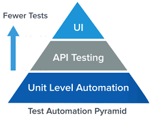

## REST API Testing with REST-assured

Rest Assured — это Java-библиотека, которая упрощает автоматизированное тестирование конечных точек APIю
Она позволяет:

* Отправлять HTTP-запросы (GET, POST, PUT, DELETE и др.)
* Валидировать ответы (статус-коды, тела ответов, заголовки)
* Работать с JSON и XML
* Использовать BDD-стиль (given-when-then)

